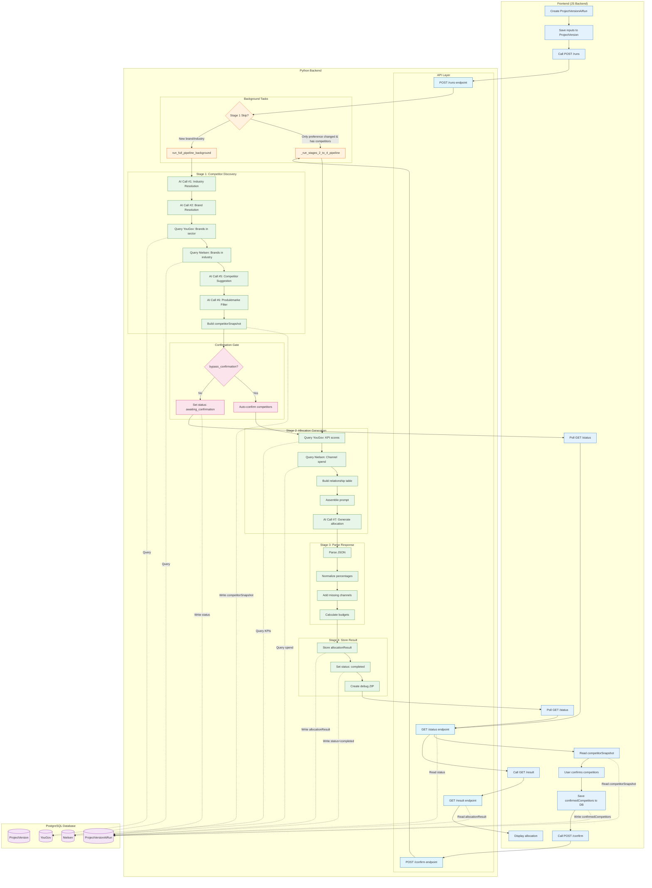

# AllocateAI System Diagrams

## DIAGRAM 1 - Complete System Flow

Shows the entire end-to-end flow from frontend calling POST /runs to result being stored in DB.



---

## DIAGRAM 2 - AI Data Fetching Flow (Stage 2)

Shows exactly how data is fetched and prepared for the LLM in Stage 2.

```mermaid
flowchart TD
    subgraph Input["Input from Stage 1"]
        IN1[confirmedCompetitors<br/>YouGov brand labels]
        IN2[competitorSnapshot<br/>YouGov to Nielsen mapping]
        IN3[Campaign inputs<br/>customer, industry, channels, budget, goalText]
    end

    subgraph YouGovQuery["YouGov Database Queries"]
        YG1[Query: SELECT brand_label, metric, score<br/>FROM yougov<br/>WHERE brand_label IN confirmedCompetitors]
        YG2[Filter: metric IN adaware, aware, consider]
        YG3[Aggregate: Latest score per brand per metric]
        YG4[Calculate: KPI uplift = latest - previous year]
        YG5[Result: brand_kpi_profiles<br/>brand, adaware_score, aware_score, consider_score, kpi_change]
    end

    subgraph NielsenQuery["Nielsen Database Queries"]
        NL1[Map: YouGov brands to Nielsen marke<br/>using competitorSnapshot]
        NL2[Query: SELECT marke, mediengruppe, SUM teuro * 1000<br/>FROM nielsen<br/>WHERE marke IN nielsen_brands<br/>GROUP BY marke, mediengruppe]
        NL3[Filter: jahr = latest 2 years]
        NL4[Aggregate: Total spend per brand per channel]
        NL5[Result: brand_spend_profiles<br/>brand, channel, spend_eur]
    end

    subgraph ProduktmarkeFilter["Produktmarke Filtering"]
        PM1[Query: DISTINCT produktmarke<br/>WHERE marke = brand]
        PM2[AI Call #6: Filter relevant produktmarke]
        PM3[Re-query: Include only relevant produktmarke]
    end

    subgraph RelationshipTable["Build Relationship Table"]
        RT1[Join: brand_kpi_profiles + brand_spend_profiles]
        RT2[For each brand + channel combination:]
        RT3[Calculate: spend_eur from Nielsen]
        RT4[Calculate: kpi_uplift from YouGov]
        RT5[Format: brand, channel, spend_eur, kpi_change_pp]
        RT6[Sort: By total spend descending]
    end

    subgraph PromptAssembly["Prompt Assembly"]
        PA1[Load: System prompt template]
        PA2[Inject: Guardrails and constraints]
        PA3[Build: User prompt with client info]
        PA4[Format: Competitor data table]
        PA5[Add: Market context from customer spend]
        PA6[Add: Goal text if Goal-to-Budget mode]
        PA7[Compile: Final system_prompt + user_prompt]
    end

    subgraph LLMCall["GPT-4o Call"]
        LLM1[Send: system_prompt + user_prompt]
        LLM2[Settings: temperature=0.7, max_tokens=4096, json_mode=true]
        LLM3[Model: gpt-4o]
        LLM4[Receive: JSON response]
    end

    subgraph ResponseParsing["Response Parsing"]
        RP1[Parse: JSON from LLM content]
        RP2[Extract: channels array]
        RP3[Extract: totalBudgetEur, kpiProjection, summary]
        RP4[Normalize: percentages to sum 100%]
        RP5[Map: Nielsen channels to UI names]
        RP6[Add: Missing user channels with 5% minimum]
        RP7[Calculate: budget_gross_eur per channel]
        RP8[Build: Final allocationResult JSON]
    end

    %% Flow connections
    IN1 --> YG1
    IN2 --> NL1
    IN3 --> PA3

    YG1 --> YG2 --> YG3 --> YG4 --> YG5
    NL1 --> NL2 --> NL3 --> NL4 --> NL5
    NL1 --> PM1 --> PM2 --> PM3 --> NL2

    YG5 --> RT1
    NL5 --> RT1
    RT1 --> RT2 --> RT3 --> RT4 --> RT5 --> RT6

    RT6 --> PA4
    PA1 --> PA2 --> PA3 --> PA4 --> PA5 --> PA6 --> PA7

    PA7 --> LLM1 --> LLM2 --> LLM3 --> LLM4

    LLM4 --> RP1 --> RP2 --> RP3 --> RP4 --> RP5 --> RP6 --> RP7 --> RP8

    %% Database connections
    DB1[(YouGov Table)] -.->|Query| YG1
    DB2[(Nielsen Table)] -.->|Query| NL2
    DB2 -.->|Query| PM1

    %% Styling
    classDef inputStyle fill:#e3f2fd,stroke:#1565c0
    classDef queryStyle fill:#e8f5e9,stroke:#2e7d32
    classDef processStyle fill:#fff3e0,stroke:#e65100
    classDef llmStyle fill:#fce4ec,stroke:#c2185b
    classDef parseStyle fill:#f3e5f5,stroke:#7b1fa2

    class IN1,IN2,IN3 inputStyle
    class YG1,YG2,YG3,YG4,YG5,NL1,NL2,NL3,NL4,NL5,PM1,PM2,PM3 queryStyle
    class RT1,RT2,RT3,RT4,RT5,RT6,PA1,PA2,PA3,PA4,PA5,PA6,PA7 processStyle
    class LLM1,LLM2,LLM3,LLM4 llmStyle
    class RP1,RP2,RP3,RP4,RP5,RP6,RP7,RP8 parseStyle
```



---

## DIAGRAM 3 - Rerun Flow (Goal Text Change Only)

Shows what happens when a user changes only the goal text and reruns.

```mermaid
flowchart TD
    subgraph UserAction["User Action"]
        UA1[User edits goalText in frontend]
        UA2[Frontend saves to ProjectVersion.goalText]
        UA3[Frontend calls POST /runs]
    end

    subgraph SkipDetection["Stage 1 Skip Detection"]
        SD1[Extract current inputs from ProjectVersion]
        SD2[Load last_inputs from rawPayload]
        SD3{Compare inputs}
        SD4[customer_name changed?]
        SD5[industry changed?]
        SD6[brand_kpi changed?]
        SD7[goal_text changed?]
        SD8[total_budget changed?]
        SD9[media_channels changed?]
        SD10{Has confirmedCompetitors?}
        SD11[Skip Stage 1 Decision]
    end

    subgraph PreserveData["Preserved DB Fields"]
        PD1[competitorSnapshot<br/>PRESERVED - Stage 1 output]
        PD2[confirmedCompetitors<br/>PRESERVED - User selection]
        PD3[chatSnapshot<br/>PRESERVED - Chat history]
    end

    subgraph ClearData["Cleared DB Fields"]
        CD1[allocationResult<br/>CLEARED - Will be regenerated]
        CD2[status<br/>RESET to pending]
        CD3[progressPct<br/>RESET to 0]
        CD4[stage<br/>RESET to null]
        CD5[errorMessage<br/>CLEARED]
    end

    subgraph Stage2Pipeline["Stage 2-4 Pipeline (Skipping Stage 1)"]
        S2P1[_run_stages_2_to_4_pipeline triggered]
        S2P2[Read confirmedCompetitors from DB]
        S2P3[Map YouGov names to Nielsen names<br/>using competitorSnapshot]
        S2P4[Set status: generating, stage: S2]
    end

    subgraph DataFetch["Stage 2: Data Fetch"]
        DF1[Query YouGov KPIs for confirmed brands]
        DF2[Query Nielsen spend for confirmed brands]
        DF3[Build relationship table]
    end

    subgraph PromptBuild["Stage 2: Prompt with New Goal"]
        PB1[Use new goalText from ProjectVersion]
        PB2[Include updated total_budget if changed]
        PB3[Include updated media_channels if changed]
        PB4[Assemble prompt with same competitor data]
        PB5[NEW goal context in prompt]
    end

    subgraph LLMGenerate["Stage 2: LLM Call"]
        LG1[Call GPT-4o with updated prompt]
        LG2[Receive new allocation based on new goal]
    end

    subgraph ParseStore["Stage 3-4: Parse and Store"]
        PS1[Parse JSON response]
        PS2[Normalize allocations]
        PS3[Store new allocationResult]
        PS4[Set status: completed]
        PS5[progressPct: 100]
    end

    subgraph Result["Result"]
        R1[New allocation reflects changed goal]
        R2[Same competitors used]
        R3[Chat history preserved]
        R4[Faster than full rerun - no AI calls #1-6]
    end

    %% Flow
    UA1 --> UA2 --> UA3
    UA3 --> SD1 --> SD2 --> SD3

    SD3 --> SD4 --> SD5 --> SD6
    SD4 -->|No| SD5
    SD5 -->|No| SD6
    SD6 -->|No| SD7
    SD7 -->|Yes - only preference| SD8
    SD8 --> SD9 --> SD10
    SD10 -->|Yes| SD11

    SD11 --> PD1
    SD11 --> PD2
    SD11 --> PD3
    SD11 --> CD1
    SD11 --> CD2
    SD11 --> CD3
    SD11 --> CD4
    SD11 --> CD5

    CD2 --> S2P1 --> S2P2 --> S2P3 --> S2P4

    S2P4 --> DF1 --> DF2 --> DF3

    DF3 --> PB1
    PD2 -.->|Use same competitors| DF1
    PD1 -.->|YouGov to Nielsen map| S2P3

    PB1 --> PB2 --> PB3 --> PB4 --> PB5

    PB5 --> LG1 --> LG2

    LG2 --> PS1 --> PS2 --> PS3 --> PS4 --> PS5

    PS5 --> R1
    R1 --> R2 --> R3 --> R4

    %% Database
    DB[(ProjectVersionAiRun)]
    PD1 -.->|Read| DB
    PD2 -.->|Read| DB
    PS3 -.->|Write| DB
    PS4 -.->|Write| DB

    %% Decision styling
    SD4 -->|Yes - identity changed| FULL[Run Full Stage 1-4]
    SD5 -->|Yes - identity changed| FULL
    SD6 -->|Yes - identity changed| FULL
    SD10 -->|No - need competitors| FULL

    %% Styling
    classDef userStyle fill:#e3f2fd,stroke:#1565c0
    classDef skipStyle fill:#fff9c4,stroke:#f9a825
    classDef preserveStyle fill:#c8e6c9,stroke:#2e7d32
    classDef clearStyle fill:#ffcdd2,stroke:#c62828
    classDef pipelineStyle fill:#fff3e0,stroke:#e65100
    classDef resultStyle fill:#e1bee7,stroke:#7b1fa2

    class UA1,UA2,UA3 userStyle
    class SD1,SD2,SD3,SD4,SD5,SD6,SD7,SD8,SD9,SD10,SD11 skipStyle
    class PD1,PD2,PD3 preserveStyle
    class CD1,CD2,CD3,CD4,CD5 clearStyle
    class S2P1,S2P2,S2P3,S2P4,DF1,DF2,DF3,PB1,PB2,PB3,PB4,PB5,LG1,LG2,PS1,PS2,PS3,PS4,PS5 pipelineStyle
    class R1,R2,R3,R4 resultStyle
```



---

## Quick Reference

### Status Transitions
```
pending (0%) → matching (10%) → awaiting_confirmation (30%) → generating (40%) → parsing (70%) → completing (90%) → completed (100%)
                      ↓                           ↓                    ↓              ↓
                   failed ←←←←←←←←←←←←←←←←←←←←←←←←←←←←←←←←←←←←←←←←←←←←←←←←←←←←←←←←←←←
                                    ↓
                              cancelled
```

### Stage 1 Skip Conditions
Skip Stage 1 if ALL of these are true:
1. `customer_name` unchanged
2. `industry` unchanged
3. `confirmedCompetitors` exists in DB
4. Only these changed: `goal_text`, `total_budget`, `media_channels`, `brand_kpi`

### Key Database Fields by Stage

| Stage | Reads | Writes |
|-------|-------|--------|
| Stage 1 | ProjectVersion (inputs), YouGov, Nielsen | competitorSnapshot, status |
| Confirmation | competitorSnapshot | confirmedCompetitors |
| Stage 2 | confirmedCompetitors, competitorSnapshot, YouGov, Nielsen | status, stage |
| Stage 3 | LLM response | - |
| Stage 4 | - | allocationResult, status, completedAt |
